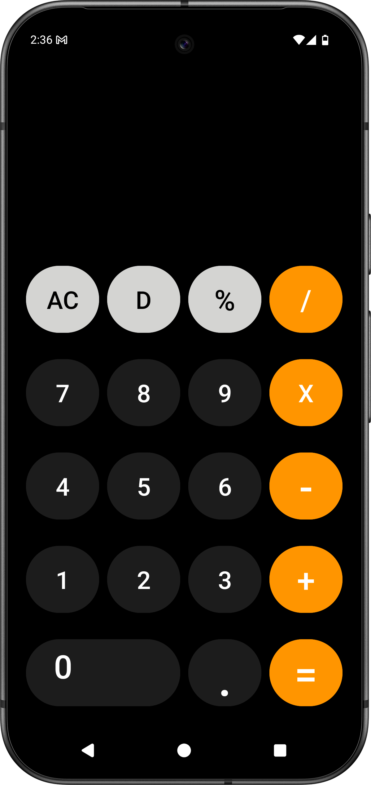

# 📱 iOS Style Calculator (Android App)

A clean and elegant iOS-style calculator app built using Android's native UI components.  
This project replicates the look and feel of Apple's iOS calculator — but developed for Android!

---

## ✨ Features

- 🧮 Basic arithmetic operations (Add, Subtract, Multiply, Divide)
- 🎨 iOS-style sleek UI using `ConstraintLayout`,`Tablelayout,LinearLayout`
- ⚡ Smooth button animations
- 🌙 Dark background with vibrant button colors
- 💡 Responsive layout across all screen sizes

---

## 🛠️ Built With

- **Java** – Main logic and interaction
- **XML** – UI Design
- **Android Studio** – Development Environment

---

## 👨‍💻 Author

- [Madhav Gadge](https://github.com/madhavgadge)
- [LinkDin](https://www.linkedin.com/in/madhav-gadge-610177343?utm_source=share&utm_campaign=share_via&utm_content=profile&utm_medium=android_app)

---
## 📸 Screenshots

| Calculator Screen | 
|-------------|
|  | 

